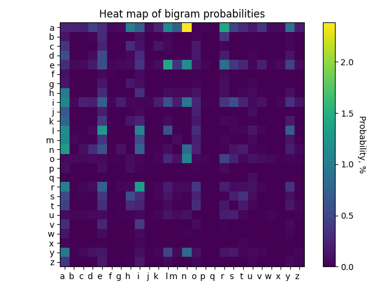

Task II of the qualifying stage of the Nfactorial Incubator 2023

python flask numpy random matplotlib language-model bigram-model

### **User**
Generate function (https://dtekio.pythonanywhere.com/) - allows you to generate a name;

Get a table (https://dtekio.pythonanywhere.com/bigram_table) - allows you to get table visualizing probabilities of bigrams

### **Functionality**
A letter bigram is a pair of letters that stand side by side in a word. For example, in the word "cat," the bigrams are "^k," "co," "from," and "t$" (^ and $ are the beginning and end of the word.)

We use letter bigrams to better understand which pairs of letters occur most often in words. This can be useful, for example, for predicting the next word in a sentence or determining the language in which a text is written.

Imagine you need to think of a name for your child. You have a list of names that already exist. The challenge: come up with a new name!

### **Model logic:**
Read the data from the file into data structures convenient for calculating probabilities;

Calculate the probability of all existing bigrams (build a sample);

Take a letter from the sample that may come as the first letter of the name (randomly);

Continue pulling the next letter from the sample, thus generating the name. This should be done until you pull the end of the name;